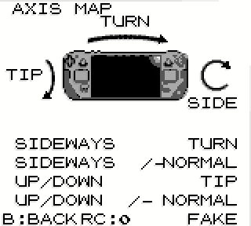
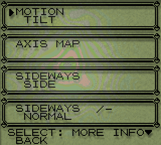
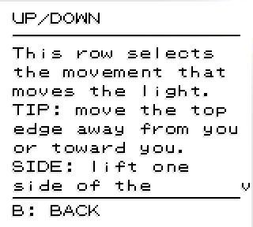
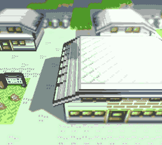

# Deck Tilt

**Designed for the gyro of the Steam Deck.** This mod moves the GBC FX light
with the motion sensor of the console. The glare, the coloured shimmer and
the drop shadow follow the angle of the console. Tilt the console, and the
light moves.

The mod needs the motion sensor of a Steam Deck. It does nothing on hardware
that has no such sensor.



The `AXIS MAP` page above shows the console and the light together. The light
moves with the console. Each drop shadow on the page turns to stay opposite
the light.

Without this mod, the game moves the light on a fixed cycle. The cycle takes
48 seconds in one direction and 90 seconds in the other. The light therefore
looks almost static.

## Versions

Give these when you report a problem. The mod reads its own version from
`manifest.json`; the `SD-GYRO` page shows the sensor state next to it.

| Part | Name | Version tested |
|---|---|---|
| This mod | Deck Tilt (`DECK_TILT`) | 0.2.0 |
| Host engine | `gen1recomp` | `main`, after tag `v0.1.47`. Reports `0.0.0-dev` |
| 3D mod (optional) | DramaticShape Voxel Mod (`DRAMATIC_SHAPE`) | 1.3.1 |
| Runtime | LOVE | 11.5 |

The engine reports `0.0.0-dev` when it is a source checkout rather than a
tagged release. The manifest of this mod accepts that, and also accepts
`>=0.1.37 <2.0.0`.

## Requirements

- A host engine that supplies the GBC FX effect. This project does not
  include that engine. See **What you must supply**.
- A Steam Deck, or a device that reports a Valve `28DE:1205` controller.
- Gyro must be on in Steam Input. See **Set up the gyro**.
- A light to move. Either set GBC FX to level 3 or level 4 (levels 1 and 2
  have no light), or let the mod draw its own. See **Two ways to draw the
  light**.

## What you must supply

This mod changes one part of a host engine. It does not run alone.

This project contains no game data. It contains no ROM image and no data
extracted from one. You must supply the engine and its data. Read `NOTICE.md`
before you use this mod.

## Tested hardware

| Item | Value |
|---|---|
| Console | Valve, product name `Galileo` |
| Operating system | SteamOS, build `20260716.2` |
| Kernel | 6.16.12-valve24.5-1-neptune-616 |
| Sensor interface | HID report, 64 bytes, 250 Hz |

The mod ran only on this hardware. It may work on other Steam Deck models.
The author did not test them.

## Install

There are two methods. The script is the quicker one. The manual method does
the same work, and you can read every step.

Both methods put the mod here:

```
<engine>/game/mods/DECK_TILT/
```

`<engine>` is the directory that holds `game/` and `love/`.

### Method 1: the script

Unpack the archive, or clone the repository, in any directory. Then run:

```
./install.sh
```

The script looks for the engine above its own directory first. If it does not
find the engine there, it searches your home directory and any removable
disc. If it still does not find the engine, give the path:

```
./install.sh /path/to/engine
```

The script copies a fixed list of files. It copies no other file, so a `.git`
directory stays behind. It stops before it writes if a different mod is
already at that path. It runs the tests of the mod when a system Lua is
available.

To remove the mod:

```
./install.sh --uninstall
```

The remove step reads the manifest first. It removes the directory only when
the manifest gives the identifier `DECK_TILT`. If the manifest does not, the
script stops and changes nothing.

### Method 2: by hand

1. Find the engine directory. It holds `game/` and `love/`.
2. Make a directory that is named `DECK_TILT` in `<engine>/game/mods/`.
3. Copy `main.lua`, `manifest.json` and the `lib` directory into it.
4. Start the game again.

The result must look like this:

```
<engine>/game/mods/DECK_TILT/
    manifest.json
    main.lua
    lib/
```

To install with git instead, clone directly into position:

```
cd <engine>/game/mods
git clone <repository-url> DECK_TILT
```

To remove the mod by hand, delete `<engine>/game/mods/DECK_TILT`.

### After you install

The engine enables a new mod by itself. To confirm this, or to disable the
mod, open `MODS` in the start menu or in `OPTIONS`.

Caution: the row in that panel shows an action, not a condition. The row
shows `DISABLE` when the mod is on. Push A once only.

Start the game again after you install the mod.

## Set up the gyro

Valve keeps the motion sensor off until a Steam Input configuration asks for
it. The sensor bytes are zero until then. All other data in the report stays
correct.

1. Push the STEAM button.
2. Select the controller settings for this game.
3. Set **Gyro Behavior** to a value that is not **Off**.

The `SENSOR` row shows `LIVE` when the sensor works. It shows `ASLEEP` when
the game finds the console but the sensor is off.

## Set up the rear button

Do this at the same time as the gyro. It is not necessary, but the mod is
much easier to use with it.

The rear button makes the light centre where you hold the console. Without
it, you must open the menu each time you change position.

1. Push the STEAM button.
2. Select the controller settings for this game.
3. Open **Edit Layout**.
4. Select the **Back Grip Buttons** group.
5. Select **L4**.
6. Set the command to the **Left Ctrl** key.

The author tested L4. Any rear button works. The game uses no rear button, so
this takes nothing away.

Push that button at any time to centre the light. The `RC` counter on the
`AXIS MAP` page increases at each push. Use that counter to confirm that
Steam sends the key.

To turn this off, set `QUICK CENTRE` to `OFF`.

## Options

Open `OPTIONS`, then select `SD-GYRO`.



Push **SELECT** on a row to read a full description of that row. The labels
are short because the screen is 160 pixels wide. This page is where the
explanation is.



Push **B** to go back to the rows.

| Row | Values | Initial value |
|---|---|---|
| `MOTION` | TILT / DEMO / OFF | TILT |
| `AXIS MAP` | opens a page | — |
| `SIDEWAYS` | TIP / SIDE / TURN / SPIN-V / SPIN-H / OFF | TURN |
| `SIDEWAYS +/-` | NORMAL / FLIPPED | NORMAL |
| `UP/DOWN` | TIP / SIDE / TURN / SPIN-V / SPIN-H / OFF | TIP |
| `UP/DOWN +/-` | NORMAL / FLIPPED | NORMAL |
| `SIDEWAYS AMT` | SUBTLE to MAX | WIDE |
| `UP/DOWN AMT` | SUBTLE to MAX | HIGH |
| `SMOOTHING` | TIGHT / NORMAL / LOOSE | TIGHT |
| `AUTO LEVEL` | SLOW / NORMAL / FAST / OFF | NORMAL |
| `SHADOW` | FOLLOW / FIXED / OFF | FOLLOW |
| `3D LIGHT` | AUTO / ON / OFF | AUTO |
| `COLOUR` | OFF / SUBTLE / NORMAL / FULL / MAX | MAX |
| `GLARE` | OFF / LOW / NORMAL / HIGH / MAX | HIGH |
| `QUICK CENTRE` | ON / OFF | ON |
| `RECENTRE` | action | — |
| `RESET ALL` | action | — |
| `SENSOR` | read only | — |

### Movements

Three movements of the console can move the light.

- **TIP** — Move the top edge away from you, or toward you.
- **SIDE** — Lift one side of the console. Hold the console upright to use
  this movement.
- **TURN** — Turn the console like a page. Put the console flat to use this
  movement.

`SPIN-V` and `SPIN-H` use the turn rate. The light moves while you turn the
console. The light stops when you stop.

Gravity cannot detect a turn around the direction of gravity. If you hold the
console upright, `TURN` therefore does nothing. Use `SIDE` in that position.

`SIDEWAYS` therefore ships as `TURN`, not `SIDE`. `SIDE` is the better
movement when you hold the console upright, but it gives nothing at all until
you press `RECENTRE` in that position, and a value that does nothing until you
find a button is a poor initial value.

Important: the three movements are measured **from the centre angle**, not
from the console. `SIDE` therefore does nothing if you set the centre while
the console was flat and then hold the console upright. The same movement
reads as `TURN` instead.

Press `RECENTRE` while you hold the console the way that you intend to play.
Then `SIDE` moves the light across the full width. `AUTO LEVEL` also corrects
this by itself, but it needs about a minute.

### Centre the light

`RECENTRE` uses the angle of the console at the time you press A. That angle
becomes the centre of the screen. The mod measures all movement from that
angle.

The result is the same in each body position. You can sit, lie down, or hold
the console upside down. Press `RECENTRE` in that position, then tilt.

`QUICK CENTRE` does the same from a rear button, at any time, without the
menu. See **Set up the rear button**.

### Keep the centre where you hold it

Your hold changes while you play. Your wrists settle, and the console goes
with them. The centre stays where you put it, so the light moves away from
the middle and stays there.

Measured on this mapping: a change of 10 degrees holds the light against one
edge. A change of 25 degrees puts the centre off the screen.

`AUTO LEVEL` moves the centre slowly to the angle that you hold. A change of
hold takes a minute, and it is absorbed. A tilt to aim takes a second, and it
is not.

| Value | Time | Result |
|---|---|---|
| `SLOW` | 45 s | Can be too slow for a hold that keeps changing. |
| `NORMAL` | 20 s | The initial value. |
| `FAST` | 8 s | Follows quickly. Can also absorb a tilt that you hold. |
| `OFF` | — | The centre stays exactly where `RECENTRE` put it. |

## How the mod reads the sensor

LOVE 11.5 has no `love.sensor` module. That module came in LOVE 12. The
included SDL2 is older than the STEAMDECK hidapi driver. SDL2 on Linux has no
sensor back end. The sensor of the Deck is not an iio device and not an evdev
device.

The controller sends a 64-byte report at 250 Hz on `/dev/hidraw*`. udev gives
read access to the console user. The mod reads this device with the FFI of
LuaJIT.

The mod does not use a `love.thread`. A blocking read on a device that stops
can hold LOVE open at exit. The mod opens the device with `O_NONBLOCK` and
reads it in the draw path. No call in the sensor code can wait.

The controller has three HID interfaces. Only one sends the state report. The
mod opens all three and keeps the one that answers.

## How the mod calculates the tilt

The mod calculates the rotation from the centre angle to the present angle.
It uses the cross product of the two gravity directions. The three parts of
that product give the three movements above.

Do not use `asin` of each gravity component. That method is correct only when
the console is flat. If you hold the console upright and lift one side,
gravity turns in the XY plane. The Y component then follows a cosine, which
is symmetrical. Both directions give the same result. On screen, the light
moves down for a left lift and also for a right lift.

The cross product has no such error. A pure lift gives zero tip. A pure tip
gives zero lift.

## How the mod removes the shake

An accelerometer measures gravity and also the movement of your hands.
Measured on this device, 71% of the samples are more than 15% away from
gravity. A filter alone cannot correct this. More filtering only adds delay.

The mod therefore uses the gyro and the accelerometer together:

- The gyro gives the fast movement. The movement of your hands does not
  affect it. It needs no filter.
- The accelerometer corrects the gyro slowly. This removes the drift of the
  gyro.

The correction time is 1.2 seconds.

### Measured constants

All constants come from measurements on this hardware. They do not come from
a data sheet.

| Constant | Value | Source |
|---|---|---|
| Gyro scale, X axis | +0.094 deg/s per count | Regressed over 1068 recorded samples of play |
| Gyro scale, Y axis | 0 | Not measured. The axis uses the accelerometer only |
| Gyro scale, Z axis | 0 | Not measured. The axis uses the accelerometer only |
| Correction time | 0.35 s | Selected by replay over the same recording |

The signs are more important than the values. A wrong value adds a delay. A
wrong sign makes the gyro and the accelerometer move the estimate in opposite
directions, so they fight and the result depends on which moved last.

The first value for the X axis was −0.019. That is 4.9 times too small, and
the sign is wrong. The light moved to an edge and stayed there, at the top or
at the bottom. Replayed over the recording, the middle error fell from 13.3
degrees to 3.5 degrees when the value was corrected.

Two axes are zero because nobody has measured them. Zero means the axis uses
the accelerometer only: less immediate, but it cannot fight. Measure them with
`tests/drivers/deck_tilt_log.lua`, which records all three rates.

## The drop shadow

At level 3, the game draws the shadow at a constant offset of 3 pixels. At
level 4, the game adds a movement of 3 pixels. The total is always positive.
The shadow therefore always falls down and to the right.

With a light that moves, this is not correct. `SHADOW FOLLOW` moves the
shadow away from the light. The shadow keeps the same length in all
directions. That length is 3.45 pixels.

`SHADOW FIXED` gives the constant offset of the game. `SHADOW OFF` removes
the shadow.

## The mod does not change the game

The mod does not write to any file of the game.

`src/render/GBCFX.lua` makes its shader text available as `GBCFX.SHADER_SRC`.
The mod reads that text, replaces two statements, and compiles the result as
its own shader. It then replaces `GBCFX.present`.

`update.sh` copies the engine over `game/` with `rsync --delete`. That copy
excludes `/mods/`. The mod copy writes only to the directory of the other
mod. A separate mod directory therefore stays through both updates.

If a future version of the game changes those two statements, the replacement
does not occur. The `SENSOR` row then shows `NO HOOK`, and the game draws the
light. `tests/deck_tilt_test.lua` does the replacement against the current
shader text at each test run.

The mod stops and gives the light back to the game in each of these
conditions:

- LuaJIT is not available
- the game cannot find the console
- the sensor is off
- the shader text does not match
- `MOTION` is `OFF`
- GBC FX is off

## Hotkeys

The mod claims no hotkey. The game uses keys 2 to 5. The other mod uses 3 and
5 to 8.

## Tests

```
cd <engine>/game
lua5.4 mods/DECK_TILT/tests/deck_tilt_test.lua
```

`./install.sh` runs this for you when a system Lua is available.

To see the effect without the gyro, set `MOTION` to `DEMO`.

`DECK_TILT_DEBUG=1` writes the condition of the sensor to the console.

## Titles

One installation of this mod applies to all titles that the host engine runs.
The mod has no code for a specific title.

The author started all three titles and confirmed for each one that the mod
loads, that the shader change applies, and that the `SD-GYRO` page opens.

The author tilted the console by hand with one title only. The other two use
the same engine, the same shader and the same sensor, so the movement is
expected to be the same. The author did not confirm this by hand.

## Two ways to draw the light

This mod has two paths. It selects one by itself. Both are supported.

| Path | Used when | What draws the light |
|---|---|---|
| Engine light | GBC FX is available | The engine's own shader, with only the light position replaced |
| Overlay | GBC FX is held off | This mod's own pass |

### The engine light

This is the original path, and it does not change. The mod replaces two
statements in the shader of the engine and nothing else. The back plate, the
screen grid, the drop shadow and the colour are all the engine's own.

This path is used when you do not have a mod that turns GBC FX off.

### The overlay

Another mod can hold GBC FX at zero. The engine then draws no light, and this
mod has nothing to move.

The overlay draws the light again on its own pass. It draws three things: the
glare, the colour and the drop shadow. It does not draw the back plate or the
screen grid. Those two model an LCD screen, and an LCD screen drawn over a 3D
world is what such a mod objects to.



The overlay changes nothing else. It does not move the light of the other
mod. It does not change the shadows of the other mod. It does not change a
day and night cycle. It does not write to the GBC FX setting, so the value
that the other mod holds at zero is left alone and the two do not fight.

| `3D LIGHT` | Result |
|---|---|
| `AUTO` | Draw the light only when GBC FX is off. This is the initial value. |
| `ON` | Always draw the light. |
| `OFF` | Never draw the light. |

`AUTO` changes nothing while GBC FX works. The engine keeps its own light and
this mod keeps moving it, as before.

Use `COLOUR` to set how much colour the light adds, or to remove the colour.
The colour is a set of rings around the light. On a large pale surface the
rings can look like thin lines. Lower the value if you see that.

Use `SHADOW` `OFF` to remove the drop shadow by itself.

## The DramaticShape voxel mod

That mod holds GBC FX at zero from version 1.3.0. Its documentation gives the
reason: its own 3D view and a full-screen GBC FX pass fight each other.

| DramaticShape version | GBC FX | This mod |
|---|---|---|
| not installed | available | Engine light |
| 1.2.1 and before | available | Engine light |
| 1.3.0 and after | held at zero | Overlay, while `3D LIGHT` is `AUTO` or `ON` |

Both mods can be active together. Set `3D LIGHT` to `OFF` if you would rather
this mod did nothing while that one is installed. The `SENSOR` row then shows
`GBCFX OFF`.

## Licence

MIT. Copyright (c) 2026 Kevin Boggs. See the `LICENSE` file.

You may fork this mod. You may change it. Keep the copyright notice and the
licence text in your copy.

## Legal

Read `NOTICE.md`. The short form:

- This project contains no game data of any kind.
- This project does not tell you how to obtain game data.
- You must supply the host engine and its data. You are responsible for that.
- The software comes with no warranty. See the `LICENSE` file.
- Product names identify hardware and software only. They do not imply an
  endorsement.

## Limits

- Hold the console flat and press `RECENTRE`, and you cannot move the light
  up. From a flat position there are only about 4 degrees of upward movement.
  Hold the console in the usual position before you press `RECENTRE`.
- `TURN` does nothing when you hold the console upright. Use `SIDE`.
- The mod only changes the position of a light. It does not change collision,
  movement, scripts, or any saved data.
